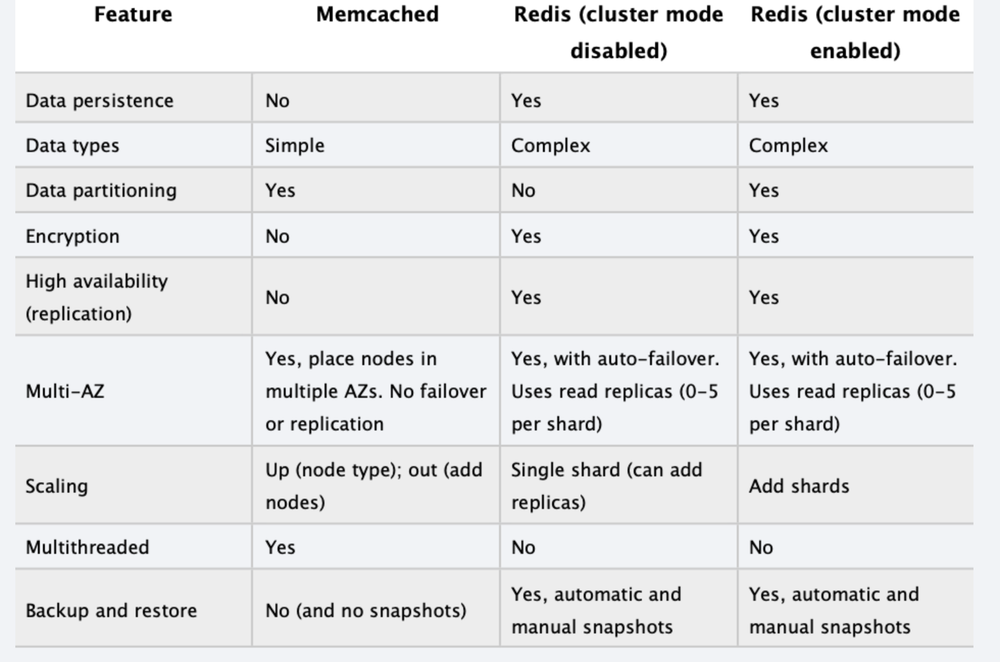

## RDS

__Supports__ : Amazon Aurora, MySQL, SQL Server, Maria DB, PostgreSQL, Oracle

__Automated backups__ 
  - Allows to recover db any point in time within retention period - 1min -35max and default 7days
  - Takes full daily snapshot (mostly when low IOPS time in night) and transaction logs throughout the day. To retain data takes a latest snapshot and apply transaction logs on it
  - Enabled by default- backup stored in S3

__Snapshots__
  - User initiated (limit 50 per region)
  - Remain even after RDS instance delete, unlike automated backups
  - Migrate Snapshot- to different database. E.g. MySQL to Aurora
  - Copy Snapshot- to different region
  - Restore Snapshot - can change the db instance class (to improve performance)

__Encryption__
  - At rest supported - using KMS - backups, snapshots & read replicas also encrypted
  - No encryption for existing instance - create a new encrypted db and migrated data to it
  - Cross region replicas and snapshots copy does not work for encrypted snapshot since the key is only available in a single region

__Multi AZs__  sync the data between another instance of RDS on another AZ for DR - can automatically failover to backup

__Read Replica__ for performance improvement(scaling) - Async replica of RDS instance and can read from read replicas. Can point individual EC2 app servers to read from replicas for read heavy operations

## Dynamodb

NoSQL db - stored on SSD storage

Spread across 3 geographically distinct data center (not AZs or Regions)

Eventual consistency of data by default. Can do strong consistency as well

__Throughput Capacity__

There are two types of read/write capacity modes:
1.  On-demand - Automatically scales for Read and Write capacity
2. Provisioned - Define for application have predicted workloads
  - Read Capcacity Units (RSU)
    - __one strongly consistent read per second for an item up to 4 KB in size__
    - __two eventually consistent reads per second, for an item up to 4 KB in size i.e. 8 KB__
    - DynamoDB must consume additional read capacity units for items greater than 4 KB for e.g. for an 8 KB item size, 2 read capacity units to sustain one strongly consistent read per second
    - Item size is rounded off to 4 KB equivalents for e.g. a 6 KB or a 8 KB 
  - Write Capcacity Units (WSU)
    - __one write per second for an item up to 1 KB in size__
    - DynamoDB must consume additional read capacity units for items greater than 1 KB for an 2 KB item size,  2 write capacity units would be required to sustain one write request per second or 4 write capacity units for a transactional write request
    - Item size is rounded off to 1 KB equivalents for e.g. a 0.5 KB or a 1 KB item would need the same WCU

__Exponential Backoff__ comes in play when client application gets error then AWS SDK will retry in exponential manner e.g. 50ms, 100ms, 200ms ... for improved control flow. If after 1min still request fails then investiage RCU/WCU.

### Dynamodb TTL

- TTL defines expiry time for your data. Expired item mark for deletion
- Reduce cost by automatically deleting the data that is no longer valid
- Can store any attribute name of your choice to store expiry timestamp

### Optimistic Concurrency Control

__Dynamodb can use (not by default) conditional writes for consistency thus follow optimistic concurrency control__

Optimistic locking is a strategy to ensure that the client-side item that you are updating (or deleting) is the same as the item in Amazon DynamoDB.

With optimistic locking, each item has an attribute that acts as a version number. If you retrieve an item from a table, the application records the version number of that item. You can update the item, but only if the version number on the server side has not changed. If there is a version mismatch, it means that someone else has modified the item before you did. The update attempt fails, because you have a stale version of the item. If this happens, you simply try again by retrieving the item and then trying to update it. Optimistic locking prevents you from accidentally overwriting changes that were made by others. It also prevents others from accidentally overwriting your changes.

### Secondary Indexes

__Global Secondary Indexes (GSI)__ are indexes that contain partition or composite partition-and-sort keys that can be different from the keys in the table on which the index is based.

__Local secondary index (LSI)__ are indexes that has the same partition key as the table, but a different sort key.

| __Characteristic__ | __GSI__  | __LSI__  | 
|-------------|------------|------------|
| Key Schema | The primary key of a global secondary index can be either simple (partition key) or composite (partition key and sort key) | The primary key of a local secondary index must be composite (partition key and sort key) |
| Key Attributes| The index partition key and sort key (if present) can be any base table attributes of type string, number, or binary|The partition key of the index is the same attribute as the partition key of the base table. The sort key can be any base table attribute of type string, number, or binary|
| Size | There are no size restrictions for global secondary indexes| For each partition key value, the total size of all indexed items must be 10 GB or less|
| Operations | Global secondary indexes can be created at the same time that you create a table. You can also add a new global secondary index to an existing table, or delete an existing one | Local secondary indexes are created at the same time that you create a table. You cannot add a local secondary index to an existing table, nor can you delete any local secondary indexes that currently exist |
| Queries | A global secondary index lets you query over the entire table, across all partitions | A local secondary index lets you query over a single partition, as specified by the partition key value in the query |
| Read Consistency  | Queries on global secondary indexes support eventual consistency only | When you query a local secondary index, you can choose either eventual consistency or strong consistency  |
|   Provisioned Throughput |    Every global secondary index has its own provisioned throughput settings for read and write activity. Queries or scans on a global secondary index consume capacity units from the index, not from the base table. The same holds true for global secondary index updates due to table writes   |   Queries or scans on a local secondary index consume read capacity units from the base table. When you write to a table, its local secondary indexes are also updated; these updates consume write capacity units from the base table    |
|   Projected Attributes    |   With global secondary index queries or scans, you can only request the attributes that are projected into the index. DynamoDB will not fetch any attributes from the table  |   If you query or scan a local secondary index, you can request attributes that are not projected in to the index. DynamoDB will automatically fetch those attributes from the table  |

### Global Tables 

- DynamoDB Global Tables is a new multi-master, cross-region replication capability of DynamoDB to support data access locality and regional fault tolerance for database workloads.
- Global Tables ensures eventual consistency
- Global Tables replicates data among regions within a single AWS account, and currently does not support cross account access

### DynamoDB Streams

- DynamoDB Streams provides __a time-ordered sequence of item-level changes__ made to data in a table in the last 24 hours, after which they are erased
- DynamoDB Streams maintains ordered sequence of the events per item however across item are not maintained
- DynamoDB Streams is designed so that every update made to the table will be represented exactly once in the stream. No Duplicates

### DynamoDB Triggers

- DynamoDB Triggers (just like database triggers) is a feature which allows execution of custom actions based on item-level updates on a table
- A trigger for a given table can be created by associating an AWS Lambda function to the stream (via DynamoDB Streams) on a table.

### DynamoDB Accelerator DAX

- DynamoDB Accelerator (DAX) is a fully managed, highly available, in-memory cache for DynamoDB that delivers up to a 10x performance improvement – from milliseconds to microseconds – even at millions of requests per second.
- DAX cluster has a primary node and zero or more read-replica nodes. Upon a failure for a primary node, DAX will automatically fail over and elect a new primary. For scaling, add or remove read replicas
- DAX is designed to run within an Amazon Virtual Private Cloud (Amazon VPC) environment.
- __Read Operations__ For eventually consistent reads (the default behavior). If DAX has the item available (a cache hit) then return to application. If not get it from DB and writes in cache. If the request specifies strongly consistent reads, DAX passes the request through to DynamoDB
- __Write Operations__ With these operations, data is first written to the DynamoDB table, and then to the DAX cluster called __write-through__
- __Item Cache__ has a Time to Live (TTL) setting, which is 5 minutes by default
- DAX also maintains __a query cache__ to store the results from Query and Scan operations. DAX also maintains an LRU list for the query cache.

### Dynamodb Transactions

With Amazon DynamoDB transactions, you can group multiple actions together and submit them as a single all-or-nothing TransactWriteItems or TransactGetItems operation.

## Amazon Redshift

- Fast and powerful, fully managed petabyte scale data warehouse service in cloud.
- OLAP - On Line Analytical Processing
- Columnar Data Storage
- Advance Compression -Columnar db can compress more because similar data is stored sequentially on disk
- Only available in single AZ
- __Encryption__ - At Rest AES-256 and in transit using SSL 

Single Node (160GB)
Multi Node 
Leader Node -manage client connection and recieves queries
Compute Node - store data, perform query for computation (upto 128 nodes)

## Elasticache
Easy to deploy, operate and scale in-memory cache in cloud.

__Memcached__ - do not support multi AZ. Good choice if your db is read heavy and not prone to lot of changes
__Redis__ - supports master/slave replication and multi AZ. saves data in key/value. Good choice if db feeling stress if mgmt keep running OLAP transactions on it.

__ElastiCache as Session Store__
Using the default provider, your ELB must send every request from a specific user to the same web server. This is known as sticky sessions and greatly limits your elasticity. First, the ELB cannot distribute traffic evenly, often sending a disproportionate amount of traffic to one server. Second, Auto Scaling cannot terminate web servers without losing some user’s session state.

By moving the session state to a central location, all the web servers can share a single copy of session state. This allows the ELB to send requests to any web server, better distributing load across all the web servers. In addition, Auto Scaling can terminate individual web servers without losing session state information.

## Aurora

Amazon aurora is MySQL compatible, relational db only runs on AWS infrastructure

Scaling - Storage auto scaling - starts with 10GB in increment of 10GB to 64TB
Compute resources can scale but during maintenances window
2 copies of data in each AZ with min 3 AZ thus 6 copies of data
Self healing as disks & data blocks are constantly scanned for errors and repaired automatically

Replicas - 2 types
Aurora replicas upto 15 - failover automatically happens
MySQL Read Replicas upto 5 - no automatic failover	

