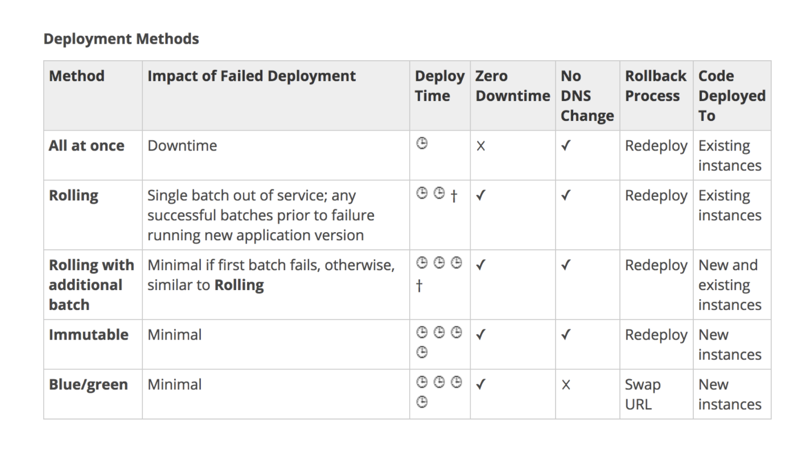

## Elastic Beanstalk 

AWS Elastic Beanstalk is a higher level service which allows you to quickly deploy out with minimum management effort a web or worker based environments using EC2, Docker, Elastic Load Balancing, Auto Scaling, RDS, CloudWatch etc.

### Deployment Methods

### Customizing Elastic Beanstalk Env

- You can customize EBstalk env using Elastic Beanstalk configuration files e.g. to install packages, create linux user/groups, run shell commands etc.)
- filename with ext of .config written in json/yaml format and must be present in .ebextensions folder of root.

### EB and RDS instances

- If you have RDS instance created by EBstalk then it will be deleted when EBstalk teardown.
- So recommendation to keep RDS outside of EBstalk config by allowing EC2 of EBstalk to connect to outside db
  These two config needed for it
  - Additional Security Group must be add to your ASG
  - Connection String parameter needs to be provided 

### EB and Docker
- Can deploy to Docker container to 
  1. Single EC2 instance
  2. Multiple docker instance to ECS cluster
- Upload code bundle to EBstalk
- To upgrade new version, upload new zip from console
- UI for rollback based on code version
- Can upload code from local machine or a public S3 bucket. __If want to use code commit then can only use EB CLI__

### Custom Platforms

AWS Elastic Beanstalk supports custom platforms. A custom platform is a more advanced customization than a custom image in several ways. A custom platform lets you develop an entire new platform from scratch, customizing the operating system, additional software, and scripts that Elastic Beanstalk runs on platform instances.

You create your own Elastic Beanstalk platform using __Packer__, which is an open-source tool for creating machine images for many platforms, including AMIs for use with Amazon Elastic Compute Cloud (Amazon EC2)