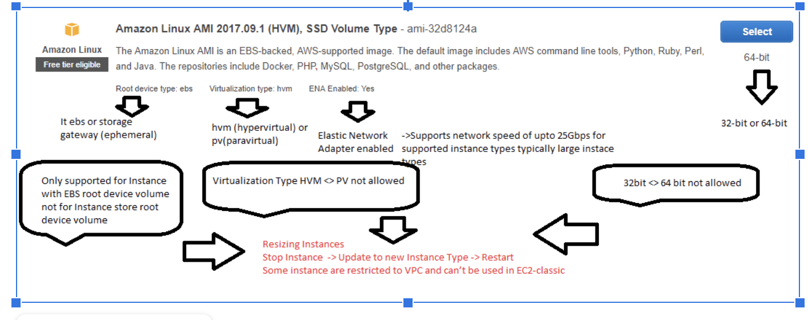
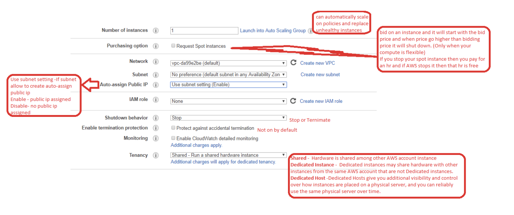
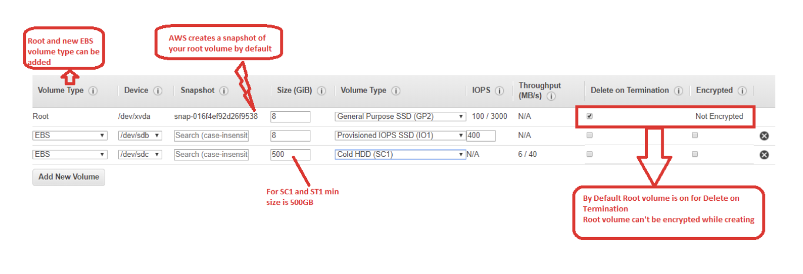
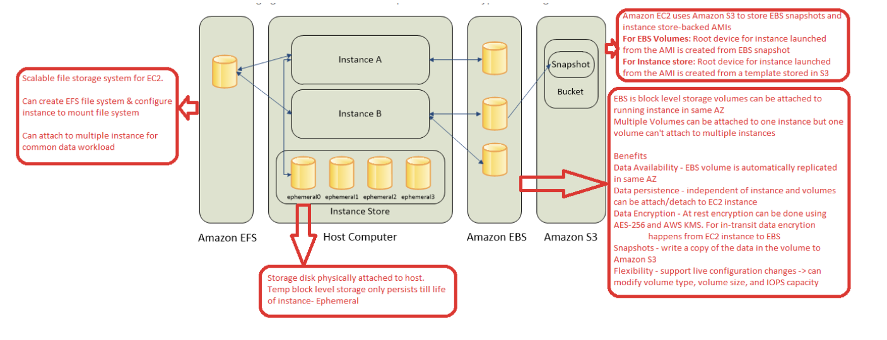
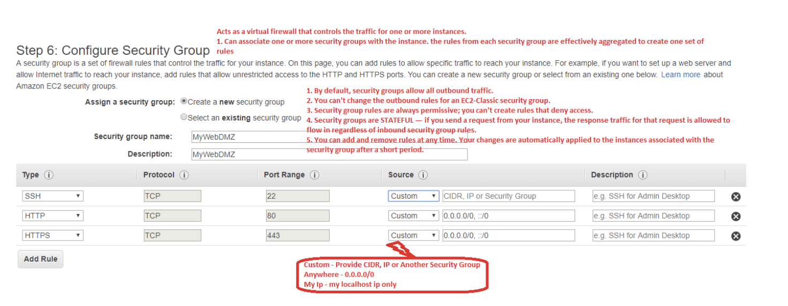

## EC2 (Elastic Cloud Compute)

EC2 is Virtual computing environments, known as instances
Preconfigured templates for your instances, known as Amazon Machine Images (AMIs), that package the bits you need for your server (including the operating system and additional software) with various configurations of CPU, memory, storage, and networking capacity for your instances, known as instance types

### Types of EC2
1. On Demand - Spin up ec2 instance when needed.
2. Spot - bid on an instance and it will start with the bid price and when price go higher than bidding price it will shut down. (Only when your compute is flexible)
Note: If you stop your spot instance then you pay for an hr and if AWS stops it then that hr is free
3. Reserved - reserved is cheaper than on demand as it will have contract on these instances (linked to Instance Types)
4. Dedicated Hosts - complete host is dedicated for your EC2 instances. Dedicated Hosts can save you money by enabling you to leverage your existing server-bound software license investments.  Dedicated Hosts also give you more flexibility, visibility, and control over the placement of instances on dedicated hardware. This makes it easier to ensure you deploy your instances in a way that meets your compliance and regulatory requirement

### AMI
1. Choose AMI

### EC2 Instance Types
2. Choose Instance Type

| __Type__ | __Family__  |
|----------|-------------|
| General Purpose | A T M |
| Compute Optimized | C |
| Memory Optimized | R X Z |
| Accelerated Computing | P G F |
| Storage Optimized | I D H |

__CPU Credits__

AWS EC2 has 2 different type of instances: Fixed Performance Instances(e.g. M3, C3 etc) and Burstable Performance Instances (e.g. T2). Fixed Performance Instances provides a consistent CPU performance whereas Burstable Performance Instances provide a baseline CPU performance under normal workload. But when the workload increases Burstable Performance Instances have the ability to burst, i.e. increase the CPU performance.

CPU Credit regulates the amount CPU burst of an instance. You can spend this CPU Credit to increase the CPU performance during the Burst period. Suppose you are operating the instance at 100% of CPU performance for 5 minutes, you will spend 5(i.e. 5*1.0) CPU Credit. Similarly if you run an instance at 50% CPU performance for 5 minutes you will spend 2.5(i.e. 5*0.5) CPU Credits.
CPU Credit Balance is simply the amount of CPU Credit available in your account at any moment.

When you create an instance you will get an initial CPU Credit. In every hour you will get certain amount of CPU credits automatically(this amount depends on the type of instance). If you don't burst the CPU performance the CPU Credit will be added to your CPU Credit Balance of your account. If you are out of CPU Credit(i.e. CPU Credit Balance turns into 0) your instance will work on baseline performance.

3. Configure Instance

### EBS (Elastic Block Storage)
4. Add Storage

Durability and Backup
* Automatic replication in AZ
* Snapshot backup to S3

I/O Provisioning
* Provision specific level of IOPS
* Or Burstable level of IOPS

#### Volume Types

1. SSD-General Purpose-gp2
IOPS upto 10,000 -Moderate workloads frequent access
Bootable
2. SSD-Provisioned IOPS -io1
IOPS upto 20,000 - Sustainable IOPS like large db e.g. Mongodb,Cassandra etc (max 16TiB)
Bootable
3. HDD-Throughput Optimized -st1
Streaming workloads requiring consistent, fast throughput like Big data, Data warehousing, log processing etc.
Not Bootable
4. HDD ,Cold -sc1
Scenarios where the lowest storage cost is important
Not Bootable
5. HDD, Magnetic - Standard (Previous generation)
Bootable

### Storage Types

### Security Groups
5. Configure Security Groups

