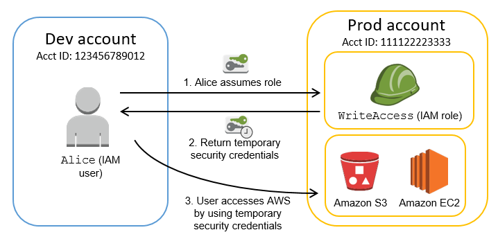
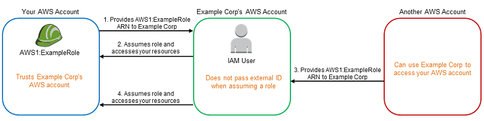
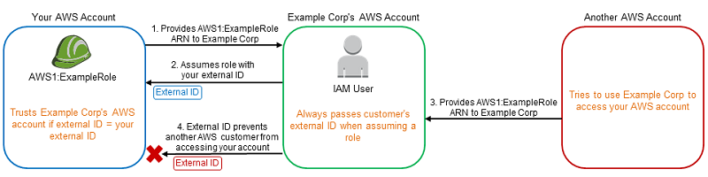

## IAM (Identity and Access Management)

### Users

- Often refers to as “Authentication” 
- User can be person or in some case application 
- Each user is linked to only one AWS account
- IAM User __cannot be renamed from AWS management console__ and has to be done from CLI or SDK tools
- IAM root user can set password policy and STS Region enablement via __Apply an IAM password policy__

### Groups

- An IAM group is a collection of IAM users. Groups let you specify permissions for multiple users
- A group is not truly an "identity" in IAM because it cannot be identified as a Principal in a permission policy. It is simply a way to attach policies to multiple users at one time.
- A group can contain many users, and a user can belong to multiple groups.(10 max)
- Groups can't be nested; they can contain only users, not other groups
- Deletion of Group - Detach users and managed polices /delete inline polices

### Roles

- A set of permissions that grant access to actions and resources in AWS.
- Role can assumed by anyone (User, Cross Account User, AWS Service like EC2 or EMR, External Auth Services) with dynamic temp credentials
- Involves 
  1. Trust Policy - who can assume role
  2. Permission Policy - what they can access

- Use roles for applications running on EC2 instances
- Delegate using roles instead of sharing credentials
- To assume a role, an application calls the __AWS STS AssumeRole__ API operation and passes the ARN of the role to use. The operation creates a new session with temporary credentials. This session has the same permissions as the identity-based policies for that role.

__Role Types__

1. AWS Service Role 
- AWS services needs to interact with other services e.g. EC2 to access S3
- Best practice is to assign these services with IAM roles instead of embedding or passing IAM user credentials directly into an instance
2. Instance Profile
- An instance profile is a container for an IAM role that you can use to pass role information to an EC2 instance when the instance starts.
- If a Role is created for EC2 instance or any other service that uses EC2 through AWS Management Console, AWS creates an Instance profile automatically with the same name as the Role. However, if the Role is created through CLI the instance profile needs to created as well
3. Cross Account Access



__Confusted Deputy Problem__




### Polices

- Defines who has access and what actions can they perform
- Most restrictive Policy always wins
- IAM policy basically states “Principal A is allowed or denied (effect) to perform Action B on Resource C given Conditions D are satisfied”

```
{
  "Version": "2012-10-17",
  "Statement": 
    { 
      "Principal" : {"AWS": ["arn:aws:iam:Account-withou-hypens:root"]}, --Only needed for resource based policies
      "Sid": "FirstStatement", 
      "Effect": "Allow",
      "Action": ["s3:ListBucket],
      "Resource": "arn:aws:s3::example_bucket",
      "Condition": {"StringLike": {"s3:prefix" ["home/$(aws:username)/"]}}
    }
}


```
| __Identity Based Permission__ | __Resource Based Permission__  |
|-------------------------------|--------------------------------|
| attached to an IAM user, group, or role and specify what the user, group or role can do | attached to a resource for e.g. S3, SNS |
| User, group, or role itself acts as a Principal | Resource-based permissions specifies both who has access to the resource (Principal) and what actions they can perform on it (Actions) |
| IAM permissions can be applied to almost all the AWS services | Resource-based permissions are supported only by some AWS services |

__Managed policies__

- Managed policies are Standalone policies that can be attached to multiple users, groups, and roles in an AWS account.
- Managed policies apply only to identities (users, groups, and roles) but not to resources.
- Managed policies allow reusability
- Two Types
 1. AWS Managed - Maintained by AWS and can’t be modified
 2. Customer Managed - created and administered by you
  - __Exam Tip:__ When you make changes to an IAM customer managed policy, and when AWS makes changes to an AWS managed policy, the changed policy doesn't overwrite the existing policy. Instead, IAM creates a new version of the managed policy

__Inline policies__

- Inline policies are created and managed by you, and are embedded directly into a single user, group, or role.
- Deletion of the Entity (User, Group or Role) or Resource deletes the In-Line policy as well

__Limitations (per account)__

| __Resource__ | __Limits__  |
|-------------------------------|--------------------------------|
| Users | 5000 |
| Groups | 300 |
| Roles | 1000 |
| Customer Managed Policies | 1500 |
| Groups an IAM user can be a member of | 10 |
| Default max no of MFA device per account | 1 |
