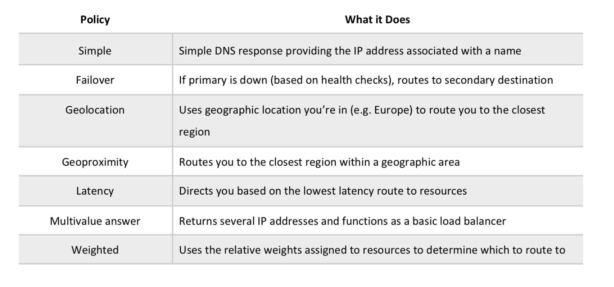

## Route53

Three main functions
- Domain Registration - allow you to register domain name
- DNS(Domain Name System) Service - translate domain name to IP for DNS queries using global DNS servers. Can route internet traffic to cloudfront, Elastic BeanStalk, ELB or S3
- Health Checking - Can monitor health of web server (domain or specific IP). Also cloudwatch alarms can be configured to if resource unavailable. DNS failover -Can be configured to route internet traffic away from unavailable resource

#### Record Types
- __A(address) Record__ - is an IPv4 address in dotted decimal notation for e.g. 192.0.2.1
TTLs are setup if A record of DNS name is changing to 5 mins and default is 2 days
- __AAAA Format__ - is an IPv6 address in colon-separated hexadecimal format
- __CNAME Format__ ( can have another domain name to same ip as A record)
 - is the same format as a domain name
 - DNS protocol does not allow creation of a CNAME record for the top node of a DNS namespace, also known as the zone apex for e.g. the DNS name example.com registration, the zone apex is example.com, a CNAME record for example.com cannot be created, but CNAME records can be created for www.example.com, newproduct.example.com etc.
 - If a CNAME record is created for a subdomain, any other resource record sets for that subdomain cannot be created for e.g. if a CNAME created for www.example.com, not other resource record sets for which the value of the Name field is www.example.com can be created
- __NS (Name Server) Format__
An NS record identifies the name servers for the hosted zone. The value for an NS record is the domain name of a name server.
- __SOA (Start of Authority) Format__
SOA record provides information about a domain and the corresponding Amazon Route 53 hosted zone

__Alias resource record sets__
- Route 53 supports alias resource record sets, which enables routing of queries to a CloudFront distribution, Elastic Beanstalk, ELB, an S3 bucket configured as a static website, or another Route 53 resource record set (can do your DNS to ELB)
- Amazon Route 53 doesn't charge for alias queries
- Alias records are not standard for DNS RFC and are an Route 53 extension to DNS functionality
- Alias records help map the apex zone (root domain without the www) records to the load balancer DNS name as the DNS specification requires “zone apex” to point to an ‘A’ record (ip address) and not to an CNAME
- Route 53 automatically recognizes changes in the resource record sets that the alias resource record set refers to for e.g. for a site pointing to an load balancer, if the ip of the load balancer changes, Route 53 will reflect those changes automatically in the DNS answers without any changes to the hosted zone that contains resource record sets- 
- If an alias resource record set points to a CloudFront distribution, a load balancer, or an S3 bucket, the time to live (TTL) can’t be set; Route 53 uses the CloudFront, load balancer, or Amazon S3 TTLs.

#### Routing Policy

