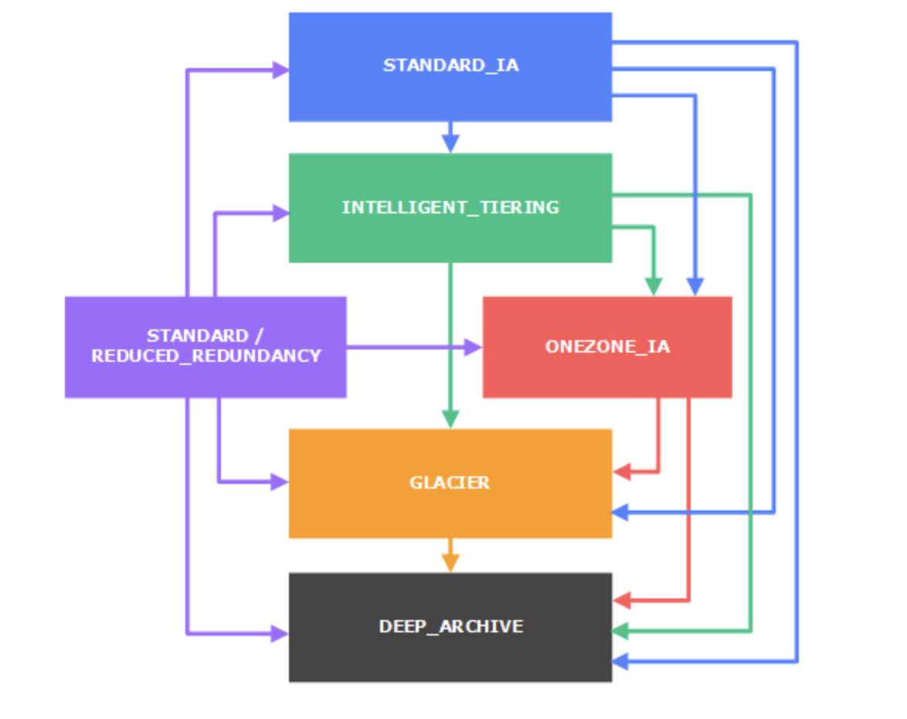

## S3 (Simple Storage Service)

Object based storage - files and its metadata
File size could be 0 -5TB (Overall Unlimited storage)
Bucket name needs to be unique globally even though buckets are created in a region
- The following rules apply for naming S3 buckets:
  - Bucket names must be between 3 and 63 characters long.
  - Bucket names can consist only of __lowercase letters__, numbers, dots (.), and hyphens (-).
  - Bucket names must __begin and end with a letter or number__.
  - Bucket names must not be formatted as an IP address (for example, 192.168.5.4).
  - Bucket names must be unique within a partition. A partition is a grouping of Regions. AWS currently has three partitions: aws (Standard Regions), aws-cn (China Regions), and aws-us-gov (AWS GovCloud [US] Regions).
  - Buckets used with Amazon S3 Transfer Acceleration can't have dots (.) in their names

__Path-Style__ 

http://bucket-name.s3-website-Region.amazonaws.com/Object

__Consistency__
Read after write consistency for PUTS of new Objects
Eventual consistency for overwrite PUTS and DELETES

__Limits__
Soft limit 100 buckets

__S3 Object__
- Properties
  - Key
  - Value 
  - Version ID
  - MetaData
  - Subresource 
    - Access Control List
    - Torrent
- MetaData cannot modify all metadata once obj is uploaded. Only some of System Defined Metadata can be modified like storage class, encryption but not creation time etc
- Object can be retrieved partially (in case multi-part file upload) or whole
- List Object of bucket will bring 1000 max records with pagination support
- Object Upload  
  1. Single Operation - Upto 5GB Obj
  2. Multipart Operation - From 5 GB -5TB (recommend for >100MB)
- When an object is copied
  - user-controlled system metadata e.g. storage class and user-defined metadata are also copied.
  - system controlled metadata e.g. the creation date etc is reset
- Deleting Objects (max 1000 deletes in single call)
  - For Versioned buckets,
    - if an object key is provided, S3 inserts a delete marker and the previous current object becomes non current object
    - if an object key with a version ID is provided, the object is permanently deleted
    - if the version ID is of the delete marker, the delete marker is removed and the previous non current version becomes the current version object
  - __Exam Tip: Can use Multi-Object Delete to delete large number of objects__
- __Pre-Signed URL__ allows user to be able download or upload a specific object without requiring AWS security credentials or permissions till expiration date-time.
Cli command
```
aws s3 presign s3://awsexamplebucket/test2.txt --expires-in 604800
```
- __Exam Tip:__ Adding randomness to file name/key will help to store files in different locations

__Storage Classes__

| __Classes__ | __Availability__ |  __Durability__ | __Availability Zones__ | __First byte latency__ |
|-------------|------------------|-----------------|------------------------|------------------------|
| S3 Standard | 99.99% | 11 9's | >= 3 | ms |
| S3 Intelligent-Tiering | 99.9% | 11 9's | >= 3 | ms |
| S3 Standard-IA | 99.9% | 11 9's | >= 3 | ms |
| S3 One Zone-IA | 99.5% | 11 9's | 1 | ms |
| S3 Glacier | 99.99% | 11 9's | >= 3 | mins or hrs |
| S3 Glacier Deep Archive | 99.99% | 11 9's | >= 3 | hrs |

__CORS Config__

defines a way for client web applications that are loaded in one domain to interact with resources in a different domain

- Scenario 1: Run javascript code from same bucket
- Scenario 2: Host web fonts from another bucket

```
<CORSConfiguration>
 <CORSRule>
   <AllowedOrigin>http://www.example1.com</AllowedOrigin>

   <AllowedMethod>PUT</AllowedMethod>
   <AllowedMethod>POST</AllowedMethod>
   <AllowedMethod>DELETE</AllowedMethod>

   <AllowedHeader>*</AllowedHeader>
 </CORSRule>
 <CORSRule>
   <AllowedOrigin>http://www.example2.com</AllowedOrigin>

   <AllowedMethod>PUT</AllowedMethod>
   <AllowedMethod>POST</AllowedMethod>
   <AllowedMethod>DELETE</AllowedMethod>

   <AllowedHeader>*</AllowedHeader>
 </CORSRule>
 <CORSRule>
   <AllowedOrigin>*</AllowedOrigin>
   <AllowedMethod>GET</AllowedMethod>
 </CORSRule>
</CORSConfiguration>
```

__Logging( Server Access Logging)__ - Disabled by default, If enable- collects logs on requester, bucket name. Request time, request action, response status etc to target bucket.

__Amazon S3 inventory tool__ - If you notice a significant increase in the number of HTTP 503-slow down responses received for Amazon S3 PUT or DELETE object requests to a bucket that has versioning enabled, you might have one or more objects in the bucket for which there are millions of versions. To determine which S3 objects have millions of versions, use the Amazon S3 inventory tool.

__S3 Transfer Acceleration__

Transfer Acceleration takes advantage of Amazon CloudFront’s globally distributed edge locations. As the data arrives at an edge location, data is routed to Amazon S3 over an optimized network path.

Endpoint: __bucket-name__.s3-accelerate.amazonaws.com

__CRR - Cross Region Replication__

- source and destination buckets must be versioning-enabled
- source and destination buckets must be in different AWS regions
- objects can be replicated from a source bucket to only one destination bucket
- S3 must have permission to replicate objects from that source bucket to the destination bucket (can be in cross account too) on your behalf.
- Only new objects created after you add a replication configuration are replicated
- Only Objects created with SSE-S3 are replicated using server-side encryption using the Amazon S3-managed encryption key
- Objects created with server-side encryption using either customer-provided (SSE-C) or AWS KMS–managed encryption (SSE-KMS) keys are not replicated
- Only customer actions are replicated & actions performed by lifecycle configuration are not replicated

__Object Versioning__

- Versioning helps to keep multiple variants of an object in the same bucket and can be used to preserve, retrieve, and restore every version of every object stored in your Amazon S3 bucket. you accrue charges for multiple versions for e.g. for a 1GB file with 5 copies with minor differences would consume 5GB of S3
- Versioning is not enabled by default and has to be explicitly enabled for each bucket
- Versioning once enabled, cannot be disabled and can only be suspended
- Objects that are stored in your bucket before you set the versioning state have a version ID of null. When you enable versioning, existing objects in your bucket do not change.
- Object Retrieval
    - For Non Versioned bucket
        - An Object retrieval always return the only object available
    - For Versioned bucket
        - An object retrieval returns the Current object.
        - Non Current object can be retrieved by specifying the version ID.
- Object Addition
    - For Non Versioned bucket
        - If an object with the same key is uploaded again it overwrites the object
    - For Versioned bucket
        - If an object with the same key is uploaded the new uploaded object becomes the Current version and the previous object becomes the Non current version.
        - A non current versioned object can be retrieved and restored hence protecting against accidental overwrites
- When an object in a bucket is deleted
    - For Non Versioned bucket
        - An object is permanently deleted and cannot be recovered
   - For Versioned bucket,
        - All versions remain in the bucket and Amazon inserts a delete marker which becomes the Current version
        - A non current versioned object can be retrieved and restored hence protecting against accidental overwrites
        - If a Object with a specific version ID is deleted, a permanent deletion happens and the object cannot be recovered
- Delete marker
    - Only a DELETE operation is allowed on the Delete Marker object
    - If the Delete marker object is deleted by specifying its version ID, the previous non current version object becomes the current version object
    - If a DELETE request is fired on the Bucket with Delete Marker as the current version, the Delete marker object is not deleted but an Delete Marker is added again
- MFA Delete
    - MFA Delete can help prevent accidental bucket. bucket owner (root account) can enable MFA delete.

__S3 Lifecycle management__

- 1000 lifecycle rules can be configured per bucket
- S3 Object Lifecycle Management rules applied to an bucket are applicable to all the existing objects in the bucket as well as the ones that will be added anew
- For Non Versioned buckets
    - Transitioning period is considered from the object’s creation date
- For Versioned buckets,
    - Transitioning period for current object is calculated for the object creation date
    - Transitioning period for non current object is calculated for the date when the object became a noncurrent versioned object
- Lifecycle configuration on MFA-enabled buckets is not supported.



__S3 Permission__ 

- Bucket owner is the AWS account that created a bucket
- Object owner is the AWS account that uploads the object to a bucket, not owned by the account


- __User based Policy__ - Attached to user, group or role to perform sections of S3 bucket
- __Resource based Policy__ - 
  1. Bucket Policy : Bucket policies provide centralized, access control to buckets and objects based on a variety of conditions, including S3 operations, requesters, resources, and aspects of the request (e.g. IP address, HTTP Referer) for AWS resources
add or deny permissions across all (or a subset) of objects within a bucket
  2. ACLS : ACLs are used to grant basic read/write permissions on resources to other AWS accounts.
cannot grant conditional permissions, nor can you explicitly deny permissions
- It is Recommended to use Canonical user ID to grant permission 
- __Bucket ACL : Only way to grant permission to log delivery group__
- __Object ACL: Only way to manage permission to an object in the bucket not owned by the bucket owner__

__S3 Error Codes__

| __Error Code__ | __Http Status Code__  |
|----------------|-----------------------|
| InvalidBucketState | 409 Conflict |
| AccessDenied | 403 Forbidden |
| InvalidBucketName | 400 Bad Request |

__Encryption__

- In Transit - SSL/TLS
- At Rest
  - Server Side Encryption 
  1. S3 Managed Keys - __SSE-S3 (Use AES-256 encryption)__ 
        - S3 handles the encryption (as it writes to disks) and decryption (when you access the objects) of the data object. When you use Server-Side Encryption with Amazon S3-Managed Keys (SSE-S3), each object is encrypted with a unique key. As an additional safeguard, it encrypts the key itself with a master key that it regularly rotates.
  2. AWS KMS - __SSE-KMS__
        - KMS uses customer master keys (CMKs) to encrypt the S3 objects.
        - Master key is never made available
        - KMS enables you to centrally create encryption keys, define the policies that control how keys can be used
  3. Server Side Encryption with Customer provided keys - __SSE-C__
        - Encryption keys can be managed and provided by the Customer and S3 manages the encryption, as it writes to disks, and decryption, when you access the objects
        - SSE-C request must be done through HTTPS 
  - Client Side Encryption
  1.  AWS KMS-managed customer master key (CMK)
        - Customer can maintain the encryption CMK with AWS KMS and can provide the CMK id to the client to encrypt the data
        - AWS S3 encryption client first sends a request to AWS KMS for the key to encrypt the object data when uploading or decrypt the data when downloading
  2. Client Side master key
        - Encryption master keys are completely maintained at Client-side
        - Client encrypts the data encryption key using the customer provided master key
        - Client-side master keys and your unencrypted data are never sent to AWS
        - If the master key is lost the data cannot be decrypted

### CloudFront

- Edge Location - where content is cached. Separate from AWS region/AZ
- Origin - Origin of file that CDN will distribute. Ie S3 bucket, EC2, ELB or Route53
- Distribution - name given to CDN consists of collection of Edge Locations
    1. Web Distribution - for websites
    2. RTMP - Used for Media Streaming
- Edge Locations are not just Read only, you can write to them too
- Objects are cached for life of TTL
- You can clear cached objects before TTL but you will be charged

Restricted viewer access - __use signed URL__ or cookies so that only authorized users can view the distribution content

For web distributions, to control how long your objects stay in a CloudFront cache before CloudFront forwards another request to your origin, you can:
- Configure your origin to add a Cache-Control or an Expires header field to each object.
- Specify a value for Minimum TTL in CloudFront cache behaviors.
- Use the default value of 24 hours.