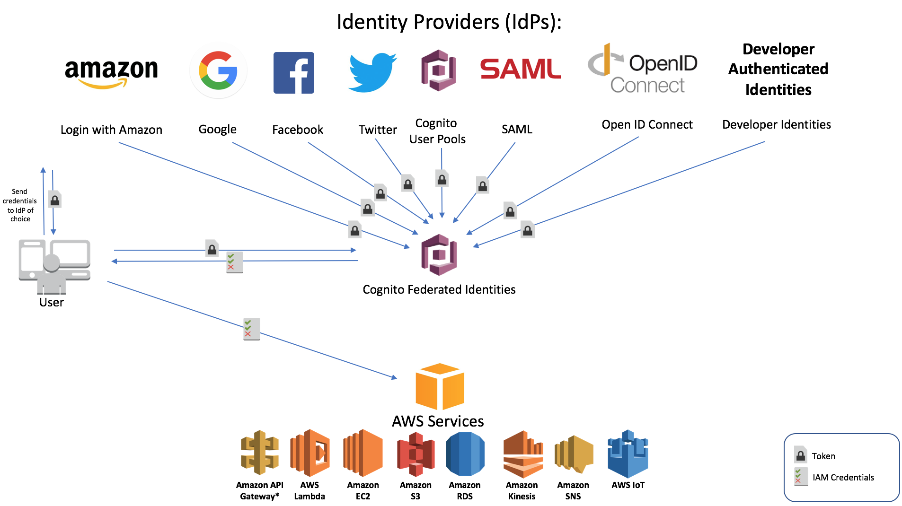
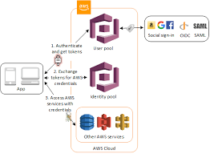

## KMS (Key Management Service)

KMS is managed service to create and manage encryption keys used to encrypt your data.

CMK (Customer Master Key) 
- KMS Encryption keys are regional
- Cannot be exported (Use CloudHSM if you want to export CMK)
- A CMK can encrypt data up to __4KB__ in size.
- You can create up to __1000 customer master keys__ per account per region.

Key Material Options
 - KMS
 - Customer Managed
 - CloudHSM

- AWS KMS supports symmetric and asymmetric CMKs.

__Symmetric customer master keys__
- When you create a customer master key (CMK) in KMS, by default, you get a symmetric CMK.
- In AWS KMS, a symmetric CMK represents a 256-bit encryption key that never leaves AWS KMS unencrypted. To use a symmetric CMK, you must call AWS KMS. Symmetric keys are used in symmetric encryption, where the same key is used for encryption and decryption.

__Asymmetric customer master keys__
- You can create an asymmetric CMK in AWS KMS. An asymmetric CMK represents a mathematically related public key and private key pair. You can give the public key to anyone, even if they're not trusted, but the private key must be kept secret.
- In an asymmetric CMK, the private key is created in AWS KMS and never leaves AWS KMS unencrypted. To use the private key, you must call AWS KMS.


### KMS API commands

```
aws kms encrypt --key-id YOURKEYIDHERE --plaintext fileb://secret.txt --output text --query CiphertextBlob | base64 --decode > encryptedsecret.txt
aws kms decrypt --ciphertext-blob fileb://encryptedsecret.txt --output text --query Plaintext | base64 --decode > decryptedsecret.txt
aws kms re-encrypt --destination-key-id YOURKEYIDHERE --ciphertext-blob fileb://encryptedsecret.txt | base64 > newencryption.txt 
aws kms enable-key-rotation --key-id YOURKEYIDHERE
```
__Exam Tip: When the CMK is asymmetric, you must specify the CMK and the encryption algorithm that was used to encrypt the ciphertext.__

### KMS Envelope Encryption

When you encrypt your data, your data is protected, but you have to protect your encryption key. One strategy is to encrypt it. Envelope encryption is the practice of encrypting plaintext data with a data key, and then encrypting the data key under another key. But, eventually, one key must remain in plaintext so you can decrypt the keys and your data. This top-level plaintext key encryption key is known as the master key

AWS KMS helps you to protect your master keys by storing and managing them securely. Master keys stored in AWS KMS, known as customer master keys (CMKs), never leave the AWS KMS FIPS validated hardware security modules unencrypted.

Thus data is encrypted using plain text data key. The data key further encrypted using a plaintext master key. 

- Encrypt
KMS Key ---encrypt--> Data Key(envelope key) --encrypts--> Data
- Decrypt
KMS Key(Master Key) --decrypt--> Encrypted Data Key --> Data Key --decrypt--> Data

__Key policies__ When you create a CMK, you determine who can use and manage that CMK. These permissions are contained in a document called the key policy. You can use the key policy to add, remove, or change permissions at any time for a customer managed CMK. But you cannot edit the key policy for an AWS managed CMK

__Grants__ is another mechanism for providing permissions. It's an alternative to key policies. Because grants can be very specific, and are easy to create and revoke, they are often used to provide temporary permissions or more granular permissions.

__Grant tokens__ When you create a grant, the permissions specified in the grant might not take effect immediately due to eventual consistency. If you need to mitigate the potential delay, use the grant token that you receive in the response to your CreateGrant request.

### Data key caching

In the AWS Encryption SDK, by default, you generate a new data key for each encryption operation. This is the most secure practice. However, in some applications, the overhead of generating a new data key for each operation is not acceptable.

Data key caching saves the plaintext and ciphertext of the data keys you use in a configurable cache. When you need a key to encrypt or decrypt data, you can reuse a data key from the cache instead of creating a new data key.

To make data key caching easier to implement, the AWS Encryption SDK provides __LocalCryptoMaterialsCache__, an in-memory, least-recently-used cache with a configurable size. The SDK manages the cache for you, including adding store, search, and match logic to all encryption and decryption operations.

### Key Deletion

You can schedule a customer master key and associated metadata that you created in AWS KMS for deletion, with a configurable waiting period from __7 to 30 days(default)__.

------------------------
## Cognito

- Provides web identity federation by acting as identity broker between your app and identity providers
- Seamless across all the devices web as well mobile. Sync data across multiple devices



### User and Identity Pools

__User Pools__ allow users to directly sign-in or indirectly via fb, google etc. via successfully generating JWT tokens works as identity broker.
__Identity Pools__ enable to create unique identities to obtain temporary limited AWS service credentials.



### Cognito Sync

__Push Synchronization__ Cognito user Push Sync to send silent push notification of user data updates to multiple device type associated with user id. It levereges SNS internally.

__Amazon Cognito Streams__ gives developers control and insight into their data stored in Amazon Cognito. Developers can now configure a Kinesis stream to receive events as data is updated and synchronized. Amazon Cognito can push each dataset change to a Kinesis stream you own in real time. You need to select the Kinesis stream to publish to and an IAM role that grants Amazon Cognito permission to put events in the selected stream.

__Amazon Cognito Events__ allows you to execute an AWS Lambda function in response to important events in Amazon Cognito. Amazon Cognito raises the Sync Trigger event when a dataset is synchronized. You can use the __Sync Trigger event__ to take an action when a user updates data. 