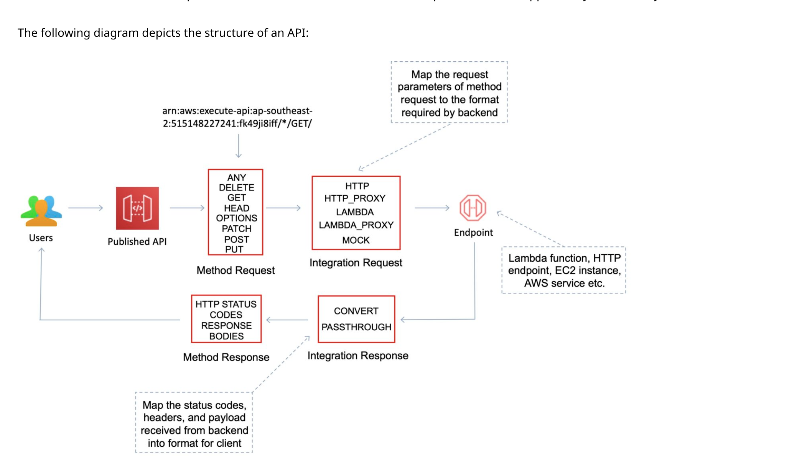

## Serverless Computing

### Lambda

- AWS lambda lets you run your code without provisioning/managing servers. Only upload a code and it will run based on event triggers
- Languages supported by AWS Lambda - Node, Go, Java, Python, C# , Ruby, and PowerShell
- __Event sources__
  - Synchronous - Function response to events 
    - API Gateway 
    - Dynamodb/Kinesis Streams
    - Cognito
    - SQS
  - Asynchronous - Function doesn't wait for response. Set invocation-type as "Event". 
    Error Handling - Can retry upto __2 times__ and if failed then send message to DLQ - SNS or SQS. Also Max age of event message in uprocessed queue is __6hrs__.
    - S3
    - SNS
    - SES
    - CloudFormation
    - CloudWatch Logs
    - CloudWatch Events
    - CodeCommit
    - Sceduled Events
    - AWS config
    - EC2 lifecyle events
- __Limitations__
  - Concurrent Execution 
    - __1000 per sec__ (default) Across all the functions in a region
    - If crosses concurrent execution and burst capacity then will get __429 error "Too many invocations__"
    - Request concurrency guarantees that set of executions which always be available for critical function, also act as limit
  - Funtion Timeout - __3sec(default)__ 1sec min - 900sec max
  - Memory Allocation - 128MB min - 3008MB (~3GB) max in 64MB increment
  - Temp Memory - /tmp folder 512MB  
  
  __Lambda with Kinesis__
  - ou can use an AWS Lambda function to process records in an Amazon Kinesis data stream. With Kinesis, you can collect data from many sources and process them with multiple consumers.
  - __If you have multiple applications that are reading records from the same stream, you can use Kinesis stream consumers instead of standard iterators. Consumers have dedicated read throughput so they don't have to compete with other consumers of the same data.__

  #### Layers
  - Zip archive that contains libraries, custom runtime, or other dependencies.
  - Keep the package small 
  - Can use upto 5 layers
  
  #### Versions
  - __Publish Version__ Creates a version from the current code and configuration of a function. Use versions to create a snapshot of your function code and configuration that doesn't change.
    - Request Syntax
```
POST /2015-03-31/functions/FunctionName/versions HTTP/1.1
Content-type: application/json

{
   "CodeSha256": "string",
   "Description": "string",
   "RevisionId": "string"
}
```

      - CodeSha256: Only publish a version if the hash value matches the value that's specified. 
      - Description: A description for the version to override the description in the function configuration.
      - RevisionId: Only update the function if the revision ID matches the ID that's specified. Use this option to avoid publishing a version if the function configuration has changed since you last updated it.

    - Errors
      - CodeStorageExceededException: You have exceeded your maximum total code size per account.
      - InvalidParameterValueException: One of the parameters in the request is invalid.
      - PreconditionFailedException: The RevisionId provided does not match the latest RevisionId for the Lambda function or alias. Call the GetFunction or the GetAlias API to retrieve the latest RevisionId for your resource.
      - ResourceConflictException: The resource already exists, or another operation is in progress.
      - ResourceNotFoundException: The resource specified in the request does not exist.
      - ServiceException: The AWS Lambda service encountered an internal error.
      - TooManyRequestsException: The request throughput limit was exceeded.
  - Can create lambda version by publishing new version - that create a new ARN 
  - By default lambda has $LATEST as version and alias
  - You reference your Lambda function using its ARN. There are two ARNs associated with this initial version:
    - Qualified ARN – The function ARN with the version suffix.
      - *arn:aws:lambda:aws-region:acct-id:function:helloworld:$LATEST*
    - Unqualified ARN – The function ARN without the version suffix.
      - *arn:aws:lambda:aws-region:acct-id:function:helloworld*
      - You can use this unqualified ARN in all relevant operations. However, you can't use it to create an alias.
  - __Aliases__ A Lambda alias is like a pointer to a specific Lambda function version. Users can access the function version using the alias ARN.
  - Can link version to alias so that downstream applications doesn't need to change on new version
  - To create an alias, use the *create-alias* command. 
  - To change an alias to point a new version of the function, use the *update-alias* command. Application will not use new code with Alias on upload. If new version is published and you want to attach to same alias then needs to be done via lambda api only not via console.
  - Use __alias routing configuration__ on an alias to send a portion of traffic to a second function version. Use the *create-alias* and *update-alias* commands to configure the traffic weights between two function versions. When you create or update the alias, you specify the traffic weight in the __routing-config__ parameter.
  ```
  $ aws lambda create-alias --name  routing-alias  --function-name  my-function  --function-version  1  \
  --routing-config  AdditionalVersionWeights={"2"=0.03} 
  
  ## Version 2 of the function receives 3 percent of the traffic
  ```
  
  #### Environment variables
  - You can use environment variables to store secrets securely and adjust your function's behavior without updating code. An environment variable is a pair of strings that are stored in a function's version-specific configuration.
  - Lambda can encrypts environment variables with a key that it creates in your account (an AWS managed customer master key (CMK)). Use of this key is free. You can also choose to provide your own key (KMS) for Lambda to use instead of the default key.

  #### Best Practices
  - Separate the Lambda handler from your core logic.
  - Take advantage of execution context reuse to improve the performance of your function. Initialize SDK clients and database connections outside of the function handler
  - Use environment variables to pass operational parameters to your function
  - Control the dependencies in your function's deployment package
  - Minimize your deployment package size to its runtime necessities
  - Reduce the time it takes Lambda to unpack deployment packages authored in Java by putting your dependency .jar files in a separate /lib directory. This is faster than putting all your function’s code in a single jar
  - Minimize the complexity of your dependencies. Prefer simpler frameworks that load quickly on execution context startup
  - Avoid using recursive code

  #### VPC aware lambda
  - Lambda can be configure for private VPC to access other resources in VPC like EC2, Databases etc.
  - To enable, provide VPC config with __subnets (recommended multiple subnets) and security group__ with access permissions
  - Lambda use VPC info to setup ENIs with ips __(Though it is changing and you dont need to use ENI anymore)__

  #### Lambda Edge
  - Lambda@Edge allows running of code across AWS locations globally without provisioning or managing servers, responding to end users at the lowest network latency
  - Lambda function can be configured to be triggered in response to CloudFront requests
  - Lambda@Edge only supports __Node.js and Python__ for global invocation by CloudFront events at this time

-------------
### SAM (Serverless Application Model)

A serverless application is a combination of Lambda functions, event sources, and other resources that work together to perform tasks. Note that a serverless application is more than just a Lambda function—it can include additional resources such as APIs, databases, and event source mappings.

#### AWS Lambda function metrics

When your function finishes processing an event, Lambda sends metrics about the invocation to Amazon CloudWatch.

__Using invocation metrics__ Invocation metrics are binary indicators of the outcome of an invocation.
  - Invocations – The number of times your function code is executed, including successful executions and executions that result in a function error.
  - Errors – The number of invocations that result in a function error. 
  - DeadLetterErrors – For asynchronous invocation, the number of times Lambda attempts to send an event to a dead-letter queue but fails.
  - DestinationDeliveryFailures – For asynchronous invocation, the number of times Lambda attempts to send an event to a destination but fails.
  - Throttles – The number of invocation requests that are throttled. When all function instances are processing requests and no concurrency is available to scale up, Lambda rejects additional requests with TooManyRequestsException. 
  - ProvisionedConcurrencyInvocations – The number of times your function code is executed on provisioned concurrency.
  - ProvisionedConcurrencySpilloverInvocations – The number of times your function code is executed on standard concurrency when all provisioned concurrency is in use.

__Performance metrics__ Performance metrics provide performance details about a single invocation. o get a sense of how fast your function processes events, view these metrics with the Average or Max statistic
  - Duration – The amount of time that your function code spends processing an event.
  - IteratorAge – For event source mappings that read from streams, the age of the last record in the event. The age is the amount of time between when the stream receives the record and when the event source mapping sends the event to the function

__Concurrency metrics__ Lambda reports concurrency metrics as an aggregate count of the number of instances processing events across a function, version, alias, or AWS Region.
  - ConcurrentExecutions – The number of function instances that are processing events. If this number reaches your concurrent executions limit for the Region, or the reserved concurrency limit that you configured on the function, additional invocation requests are throttled.
  - ProvisionedConcurrentExecutions – The number of function instances that are processing events on provisioned concurrency. For each invocation of an alias or version with provisioned concurrency, Lambda emits the current count.
  - ProvisionedConcurrencyUtilization – For a version or alias, the value of ProvisionedConcurrentExecutions divided by the total amount of provisioned concurrency allocated.
  - UnreservedConcurrentExecutions – For an AWS Region, the number of events that are being processed by functions that don't have reserved concurrency.

#### AWS Mobile SDK with Lambda
You upload the code you want AWS Lambda to execute and then invoke it from your mobile app using the AWS Lambda SDK included in the AWS Mobile SDK. You can make both direct (synchronous) calls to retrieve or check data in real time as well as asynchronous calls. You can also define a custom API using Amazon API Gateway and invoke your Lambda functions through any REST compatible client.

#### SAM Template Specifications

__Globals__
- Resources in an AWS SAM template tend to have shared configuration, such as Runtime, Memory, VPCConfig, Environment, and Cors. Instead of duplicating this information in every resource, you can write them once in the Globals section and let your resources inherit them.
- The value specified in the Resources section replaces the value in the Globals section.

```
Globals:
  Function:
    Runtime: nodejs6.10
    Timeout: 180
    Handler: index.handler
    Environment:
      Variables:
        TABLE_NAME: data-table

Resources:
  HelloWorldFunction:
    Type: AWS::Serverless::Function
    Properties:
      Environment:
        Variables:
          MESSAGE: "Hello From SAM"

  ThumbnailFunction:
    Type: AWS::Serverless::Function
    Properties:
      Events:
        Thumbnail:
          Type: Api
          Properties:
            Path: /thumbnail
            Method: POST
```
__Resources__

| __Resources__ | __Details__  |
|-------------------------------|--------------------------------|
| AWS::Serverless::Api | Creates a collection of Amazon API Gateway resources and methods that can be invoked through HTTPS endpoints. |
| AWS::Serverless::Application | mbeds a serverless application from the AWS Serverless Application Repository or from an Amazon S3 bucket as a nested application. |
| AWS::Serverless::Function | Creates a Lambda function, IAM execution role, and event source mappings that trigger the function|
| AWS::Serverless::HttpApi | Creates an API Gateway HTTP API, which enables you to create RESTful APIs with lower latency and lower costs than REST APIs |
| AWS::Serverless::LayerVersion | Creates a Lambda LayerVersion that contains library or runtime code needed by a Lambda Function.|
| AWS::Serverless::SimpleTable | Creates a DynamoDB table with a single attribute primary key. It is useful when data only needs to be accessed via a primary key.|


#### SAM commands

```
# Download a sample application
sam init

# Build your application
cd sam-app
sam build

# Invoking function with event file
sam local invoke "Ratings" -e event.json

# Running API Gateway Locally
sam local start-api

# Generating Sample Event Payloads
sam local generate-event [SERVICE]

#Deploy your application
sam deploy --guided

```

#### Deploying

If you want AWS SAM to guide you through the deployment with prompts, specify the --guided flag. When you specify this flag, the sam deploy command zips your application artifacts, uploads them to Amazon Simple Storage Service (Amazon S3), and deploys your application to the AWS Cloud.

```
# Deploy an application using prompts:
sam deploy --guided
```

__Deploying Gradually__

If you use AWS SAM to create your serverless application, it comes built-in with CodeDeploy to provide gradual Lambda deployments. With just a few lines of configuration, AWS SAM does the following for you:
  - Deploys new versions of your Lambda function, and automatically creates aliases that point to the new version.
  - Gradually shifts customer traffic to the new version until you're satisfied that it's working as expected, or you roll back the update.
  - Defines pre-traffic and post-traffic test functions to verify that the newly deployed code is configured correctly and your application operates as expected.
  - Rolls back the deployment if CloudWatch alarms are triggered.

```
Resources:
 MyLambdaFunction:
   Type: AWS::Serverless::Function
   Properties:
     Handler: index.handler
     Runtime: nodejs4.3
     CodeUri: s3://bucket/code.zip

     AutoPublishAlias: live

     DeploymentPreference:
       Type: Canary10Percent10Minutes 
       Alarms:
         # A list of alarms that you want to monitor
         - !Ref AliasErrorMetricGreaterThanZeroAlarm
         - !Ref LatestVersionErrorMetricGreaterThanZeroAlarm
       Hooks:
         # Validation Lambda functions that are run before & after traffic shifting
         PreTraffic: !Ref PreTrafficLambdaFunction
         PostTraffic: !Ref PostTrafficLambdaFunction
```

__AutoPublishAlias:__ By adding this property and specifying an alias name, AWS SAM:
  - Detects when new code is being deployed, based on changes to the Lambda function's Amazon S3 URI.
  - Creates and publishes an updated version of that function with the latest code.
  - Creates an alias with a name that you provide (unless an alias already exists), and points to the updated version of the Lambda function. 

__Deployment Preference Type:__ 
  - Canary: Traffic is shifted in two increments. You can choose from predefined canary options. The options specify the percentage of traffic that's shifted to your updated Lambda function version in the first increment, and the interval, in minutes, before the remaining traffic is shifted in the second increment. 
    - Canary10Percent30Minutes
    - Canary10Percent5Minutes
    - Canary10Percent10Minutes
    - Canary10Percent15Minutes
  - Linear: Traffic is shifted in equal increments with an equal number of minutes between each increment. You can choose from predefined linear options that specify the percentage of traffic that's shifted in each increment and the number of minutes between each increment.
    - Linear10PercentEvery10Minutes
    - Linear10PercentEvery1Minute
    - Linear10PercentEvery2Minutes
    - Linear10PercentEvery3Minutes
  - All-at-once: All traffic is shifted from the original Lambda function to the updated Lambda function version at once.
    - AllAtOnce

__Alarms:__ These are CloudWatch alarms that are triggered by any errors raised by the deployment. They automatically roll back your deployment.

__Hooks:__ These are pre-traffic and post-traffic test functions that run sanity checks before traffic shifting starts to the new version, and after traffic shifting completes.
  - PreTraffic: Before traffic shifting starts, CodeDeploy invokes the pre-traffic hook Lambda function. This Lambda function must call back to CodeDeploy and indicate success or failure. If the function fails, it aborts and reports a failure back to AWS CloudFormation. If the function succeeds, CodeDeploy proceeds to traffic shifting.
  - PostTraffic: After traffic shifting completes, CodeDeploy invokes the post-traffic hook Lambda function. This is similar to the pre-traffic hook, where the function must call back to CodeDeploy to report a success or failure. Use post-traffic hooks to run integration tests or other validation actions.

----------------------
### API Gateway

- AWS API Gateway is a fully managed service that makes it easy for developers to publish, maintain, monitor, and secure APIs at any scale
- API Gateway handles all of the tasks involved in accepting and processing up to hundreds of thousands of concurrent API calls, including traffic management, authorization and access control, monitoring, and API version management.
- Supports Multiple backends
  - AWS lambda
  - Http endpoints exposed via Elastic BeanStalk, EC2 or ELB
  - Other AWS services
  - On-Prem http endpoints via public internet
- Can create two kind of APIs
  - Rest
  - Websocket
- Can deploy to Regional, Edge or private vpc
- Can create as proxy resource means all the paths are valid



__Methods__ 
- API Gateway Methods are HTTP methods associated with an API Gateway resource.
- Each resource URL can have HTTP methods such as: GET, PUT, POST and DELETE.
- AWS also offers the “ANY” method as a catch-all.

__Deployments__
- Deployments are a snapshot of the APIs resources and methods.
- Deployments must be created and associated with a stage in order for anyone to access the API.
- You can now use __canary release deployments__ to gradually roll out new APIs in Amazon API Gateway. This helps you more safely roll out API changes and limit the blast radius of new deployments. To deploy an API with a canary release, you create a canary release deployment by adding canary settings to the stage of a regular deployment.

__Stage and Stage Variables__
- Stage variables are like environment variables for API Gateway.
- Use cases for stage variables:
  - Configure HTTP endpoints your stages talk to (dev, test, prod etc.).
  - Pass configuration parameters to AWS Lambda through mapping templates.
- Stage variables are passed to the “context” object in Lambda.

A stage variable can be used as part of an HTTP integration URL, as shown in the following examples:
 - A full URI without protocol – http://${stageVariables.<variable_name>}
 - A full domain – http://${stageVariables.<variable_name>}/resource/operation
 - A subdomain – http://${stageVariables.<variable_name>}.example.com/resource/operation
 - A path – http://example.com/${stageVariables.<variable_name>}/bar
 - A query string – http://example.com/foo?q=${stageVariables.<variable_name>}

__Mapping Templates__
- Mapping templates can be used to modify request / responses. Rename parameters. Modify body content. Add headers.
- Uses Velocity Template Language (VTL).
- Filter output results (remove unnecessary data).

__Caching__
- You can add caching to API calls by provisioning an Amazon API Gateway cache and specifying its size in gigabytes.
- API Gateway caches responses for a specific amount of time (time to live or TTL). The default TTL is __300 seconds__ (min 0, max 3600).
- You can encrypt caches.
- The cache capacity is between 0.5GB to 237GB.
- You are able to flush the entire cache (invalidate it) immediately if required. 
- Clients can invalidate the cache with the header: __Cache-Control: max-age=0__ . If you don't impose an __InvalidateCache policy__ (or choose the __Require authorization__ check box in the console), any client can invalidate the API cache. If most or all of the clients invalidate the API cache, this could significantly increase the latency of your API.

__Enable CORS support__

1. Includes an Origin header.
2. Uses the OPTIONS method.
3. Includes the following headers:
  - Access-Control-Request-Method
  - Access-Control-Request-Headers

__API Throttling__

- Limits:
  - By default API Gateway limits the steady-state request rate to __10,000 requests per second__.
  - The maximum concurrent requests is 5,000 requests across all APIs within an AWS account.
  - If you go over 10,000 requests per second or 5,000 concurrent requests you will receive a __429 Too Many Requests error response__.
- Amazon API Gateway provides two basic types of throttling-related settings:
  - Server-side throttling limits are applied across all clients. These limit settings exist to prevent your API—and your account—from being overwhelmed by too many requests.
  - Per-client throttling limits are applied to clients that use API keys associated with your usage policy as a client identifier.

#### Usage Plan and API Keys

- A usage plan specifies who can access one or more deployed API stages and methods — and also how much and how fast they can access them.
- The plan uses API keys to identify API clients and meters access to the associated API stages for each key.
- It also lets you configure throttling limits and quota limits that are enforced on individual client API keys.

### Athena

- An interactive query service that makes it easy to analyze data directly on S3 using __Standard SQL__
- It can query unstructed or structred data. 
- It doesn't load data in compute and query directly on S3 thus serverless
- OJBC and JDBC driverss to connect to standard SQL tools, analytics tools or business intellegence tools
- Can easitly integrate to AWS Glue (ETL service) to create tables and schema.
- Can query only latest version of bucket
- Uncrypted S3 data can queried from different region via Athena. Though encrypted data needs to be in same region with appropriate perssioms to decrypt it via Athena
- Athena doesn't support
  - Different storage classes within a bucket
  - GLACIER storage class
  - Requesters pays bucket

----------------------
### ECS (Elastic Container Service)

- Amazon Elastic Container Service (ECS) is a highly scalable, high-performance container management service that supports Docker containers and allows you to easily run applications on a managed cluster of Amazon EC2 instances.

#### Launch Types

There are two launch types


#### ECS Terminology


__Cluster__

- ECS Clusters are a logical grouping of container instances that you can place tasks on.
- ECS allows the definition of a specified number (desired count) of tasks to run in the cluster.
- Clusters are region-specific.

__ECS Container Instances__

- The EC2 instances used as container hosts must run an ECS agent.
- For non-AWS Linux instances to be used on AWS you must manually install the ECS container agent.The agent is configured in /etc/ecs/ecs.config.

__Images__

- Containers are created from a read-only template called an image which has the instructions for creating a Docker container.
- Only Docker containers are currently supported on ECS.

__Tasks and Task Definations__

- A task definition is a text file in JSON format that describes one or more containers, up to a maximum of 10.
- Some of the parameters you can specify in a task definition include:
  - docker images
  - CPU and Memory
  - docker networking mode
  - container port to host port
  - env variables
  - data Volumes 

__Task Placement Strategy__

Amazon ECS supports the following task placement strategies:
- binpack – place tasks based on the least available amount of CPU or memory. This minimizes the number of instances in use.
- random – place tasks randomly.
- spread – place tasks evenly based on the specified value

Amazon ECS supports the following types of task placement constraints:
- distinctInstance – Place each task on a different container instance.
- memberOf – Place tasks on container instances that satisfy an expression.

__Service Scheduler__

- Ensures that the specified number of tasks is constantly running and reschedules tasks when a task fails.
- It can ensure tasks are registered against an ELB.

#### Auto Scaling

__Service Auto Scaling__ can optionally be configured to use Service Auto Scaling to adjust the desired task count up or down automatically.

__Cluster Auto Scaling__ A Capacity Provider can be associated with an EC2 Auto Scaling Group (ASG).

---------------------

