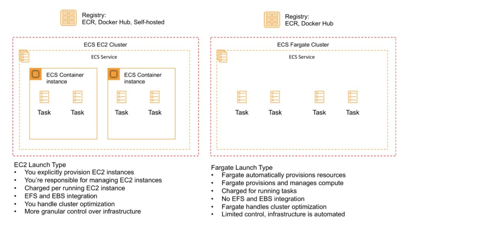
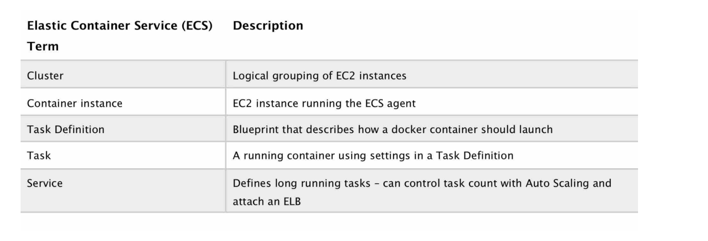

## Serverless Computing

### Lambda

- AWS lambda lets you run your code without provisioning/managing servers. Only upload a code and it will run based on event triggers
- Languages supported by AWS Lambda - Node, Go, Java, Python, C# , Ruby, and PowerShell
- Event sources
  - Synchronous - Function response to events 
    - API Gateway 
    - Dynamodb/Kinesis Streams
    - Cognito
    - SQS
  - Asynchronous - Function doesn't wait for response. Set invocation-type as "Event". 
    Error Handling - Can retry upto __2 times__ and if failed then send message to DLQ - SNS or SQS. Also Max age of event message in uprocessed queue is __6hrs__.
    - S3
    - SNS
    - SES
    - CloudFormation
    - CloudWatch Logs
    - CloudWatch Events
    - CodeCommit
    - Sceduled Events
    - AWS config
    - EC2 lifecyle events
- Limitations
  - Concurrent Execution 
    - __1000 per sec__ (default) Across all the functions in a region
    - If crosses concurrent execution and burst capacity then will get __429 error "Too many invocations__"
    - Request concurrency guarantees that set of executions which always be available for critical function, also act as limit
  - Funtion Timeout - __3sec(default)__ 1sec min - 900sec max
  - Memory Allocation - 128MB min - 3008MB (~3GB) max in 64MB increment
  - Temp Memory - /tmp folder 512MB
- Versioning
  - Can create lambda version by publishing new version - that create a new ARN 
  - Can link version to alias so that downstream applications doesn't need to change on new version
  
  #### Layers
  - Zip archive that contains libraries, custom runtime, or other dependencies.
  - Keep the package small 
  - Can use upto 5 layers
  
  #### Versions
  - By default lambda has $LATEST as version and alias
  - Can publish a version and also attach alias to it. Alias has its own ARN
  - Application will not use new code with Alias on upload. If new version is published and you want to attach to same alias then needs to be done via lambda api.
  
  #### VPC aware lambda
  - Lambda can be configure for private VPC to access other resources in VPC like EC2, Databases etc.
  - To enable, provide VPC config with subnets (recommended multiple subnets) and security group with access permissions
  - Lambda use VPC info to setup ENIs with ips __(Though it is changing and you dont need to use ENI anymore)__

  #### Lambda Edge
  - Lambda@Edge allows running of code across AWS locations globally without provisioning or managing servers, responding to end users at the lowest network latency
  - Lambda function can be configured to be triggered in response to CloudFront requests
  - Lambda@Edge only supports __Node.js and Python__ for global invocation by CloudFront events at this time

### SAM (Serverless Application Model)

A serverless application is a combination of Lambda functions, event sources, and other resources that work together to perform tasks. Note that a serverless application is more than just a Lambda function—it can include additional resources such as APIs, databases, and event source mappings.

#### SAM commands

```
#Step 1 - Download a sample application
sam init

#Step 2 - Build your application
cd sam-app
sam build

#Step 3 - Deploy your application
sam deploy --guided

```


### API Gateway

- AWS API Gateway is a fully managed service that makes it easy for developers to publish, maintain, monitor, and secure APIs at any scale
- API Gateway handles all of the tasks involved in accepting and processing up to hundreds of thousands of concurrent API calls, including traffic management, authorization and access control, monitoring, and API version management.
- Supports Multiple backends
  - AWS lambda
  - Http endpoints exposed via Elastic BeanStalk, EC2 or ELB
  - Other AWS services
  - On-Prem http endpoints via public internet
- Can create two kind of APIs
  - Rest
  - Websocket
- Can deploy to Regional, Edge or private vpc
- Can create as proxy resource means all the paths are valid

### Athena

- An interactive query service that makes it easy to analyze data directly on S3 using __Standard SQL__
- It can query unstructed or structred data. 
- It doesn't load data in compute and query directly on S3 thus serverless
- OJBC and JDBC driverss to connect to standard SQL tools, analytics tools or business intellegence tools
- Can easitly integrate to AWS Glue (ETL service) to create tables and schema.
- Can query only latest version of bucket
- Uncrypted S3 data can queried from different region via Athena. Though encrypted data needs to be in same region with appropriate perssioms to decrypt it via Athena
- Athena doesn't support
  - Different storage classes within a bucket
  - GLACIER storage class
  - Requesters pays bucket

### ECS (Elastic Container Service)

- Amazon Elastic Container Service (ECS) is a highly scalable, high-performance container management service that supports Docker containers and allows you to easily run applications on a managed cluster of Amazon EC2 instances.

#### Launch Types

There are two launch types



#### ECS Terminology



__Cluster__

- ECS Clusters are a logical grouping of container instances that you can place tasks on.
- ECS allows the definition of a specified number (desired count) of tasks to run in the cluster.
- Clusters are region-specific.

__ECS Container Instances__

- The EC2 instances used as container hosts must run an ECS agent.
- For non-AWS Linux instances to be used on AWS you must manually install the ECS container agent.The agent is configured in /etc/ecs/ecs.config.

__Images__

- Containers are created from a read-only template called an image which has the instructions for creating a Docker container.
- Only Docker containers are currently supported on ECS.

__Tasks and Task Definations__

- A task definition is a text file in JSON format that describes one or more containers, up to a maximum of 10.
- Some of the parameters you can specify in a task definition include:
  - docker images
  - CPU and Memory
  - docker networking mode
  - container port to host port
  - env variables
  - data Volumes 

__Task Placement Strategy__

Amazon ECS supports the following task placement strategies:
- binpack – place tasks based on the least available amount of CPU or memory. This minimizes the number of instances in use.
- random – place tasks randomly.
- spread – place tasks evenly based on the specified value

Amazon ECS supports the following types of task placement constraints:
- distinctInstance – Place each task on a different container instance.
- memberOf – Place tasks on container instances that satisfy an expression.

__Service Scheduler__

- Ensures that the specified number of tasks is constantly running and reschedules tasks when a task fails.
- It can ensure tasks are registered against an ELB.

#### Auto Scaling

__Service Auto Scaling__ can optionally be configured to use Service Auto Scaling to adjust the desired task count up or down automatically.

__Cluster Auto Scaling__ A Capacity Provider can be associated with an EC2 Auto Scaling Group (ASG).


