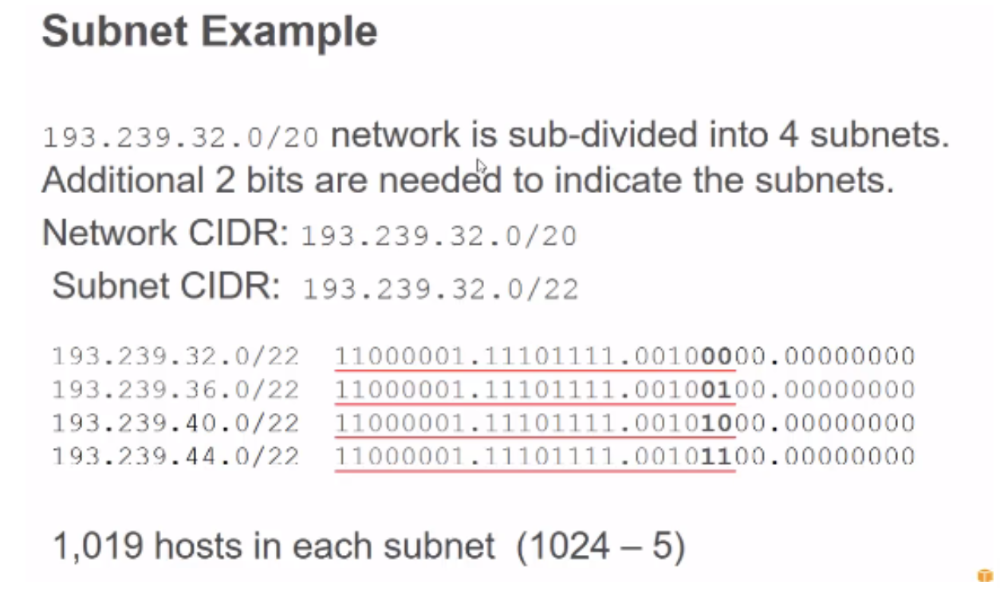

## VPC (Virtual Private Cloud)

A virtual private cloud (VPC) is a virtual network dedicated to your AWS account. It is logically isolated from other virtual networks in the AWS Cloud

### CIDR Basics

- CIDR (Classless Inter Domain Routing) was introduced for more flexible ip addressing and to conserve IPv4 address space
  - IPv4 address has 4 octets. Each octet can be from 0 -255 (2^8 = 256)
  -  1st octet can’t be 127 range as reserved for diagnosis. And 127.0.0.1 is loopback address(localhost).
  - Host IDs can’t be all 0s or 255s as 0s is network id and 255 is broadcast id
    Example: 192.168.10.0 is Network ID and  192.168.10.255 is Broadcast ID for earlier network

 /number means number of bits to identify network and rest can be used as host id for ip        address

So /32 after address will be a particular host

### Subnet

Network can be sub-divided into subnets inside an org. CIDR block convention to identify subnets

Number of subnets be based on additional bits. If you need 4  means 2^2 bits=4
If you need 8 means 2^3bits = 8 and so forth 

Each subnet in VPC must be associated with a route table however multiple subnets can be associated to a single route table.
